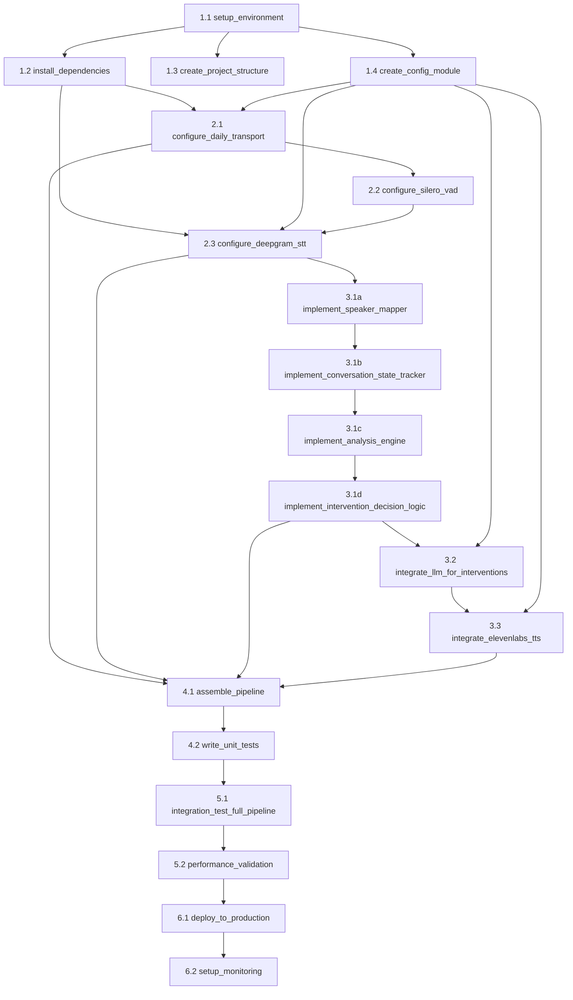

# Goal-Oriented Action Plan (GOAP)
# Voice Referee System - Architecture A: Mixed Audio + Deepgram Diarization

**Generated**: 2025-12-11
**Architecture**: Mixed Audio + Deepgram Diarization
**Framework**: Pipecat Cloud
**Target Latency**: 500-730ms end-to-end

---

## 1. STATE DEFINITIONS

### 1.1 Current State
```yaml
environment_ready: false
dependencies_installed: false
project_structure_created: false
config_module_exists: false
transport_configured: false
stt_configured: false
vad_configured: false
processor_implemented: false
llm_integrated: false
tts_integrated: false
pipeline_assembled: false
tests_written: false
integration_tested: false
performance_validated: false
deployed: false
monitoring_active: false
```

### 1.2 Goal State
```yaml
environment_ready: true
dependencies_installed: true
project_structure_created: true
config_module_exists: true
transport_configured: true
stt_configured: true
vad_configured: true
processor_implemented: true
llm_integrated: true
tts_integrated: true
pipeline_assembled: true
tests_written: true
integration_tested: true
performance_validated: true
deployed: true
monitoring_active: true
```

### 1.3 Intermediate States (Milestones)
- **M1**: Foundation Ready (env + deps + structure)
- **M2**: Core Services Configured (transport + STT + VAD)
- **M3**: Processing Logic Complete (processor + LLM + TTS)
- **M4**: Pipeline Integrated (assembly + basic tests)
- **M5**: Validated & Deployed (performance + deployment + monitoring)

---

## 2. ACTION CATALOG

### Phase 1: Foundation Setup

#### ACTION 1.1: setup_environment
```yaml
Name: setup_environment
Preconditions:
  - system_requirements_met: true (Python 3.10+, pip, git)
Effects:
  - environment_ready: true
  - virtual_env_created: true
Cost: 1
Tools: [bash, pip, venv]
Execution: code (deterministic)
Success_Criteria:
  - Python venv activated
  - .env file created with template
  - All required API keys documented
Validation:
  - python --version shows 3.10+
  - pip list shows no packages (clean env)
Risk: LOW
  - Mitigation: Use pyenv for version management if system Python < 3.10
```

#### ACTION 1.2: install_dependencies
```yaml
Name: install_dependencies
Preconditions:
  - environment_ready: true
Effects:
  - dependencies_installed: true
  - pipecat_available: true
  - daily_available: true
  - deepgram_available: true
Cost: 2
Tools: [pip, requirements.txt]
Execution: code
Success_Criteria:
  - All packages in requirements.txt installed
  - No dependency conflicts
  - Import tests pass
Validation:
  - pip freeze shows pipecat-ai, daily-python, deepgram-sdk
  - python -c "import pipecat" succeeds
Risk: MEDIUM
  - Mitigation: Pin exact versions in requirements.txt
  - Fallback: Use poetry for better dependency resolution
```

#### ACTION 1.3: create_project_structure
```yaml
Name: create_project_structure
Preconditions:
  - environment_ready: true
Effects:
  - project_structure_created: true
  - directories_exist: true
Cost: 1
Tools: [bash, mkdir]
Execution: code
Success_Criteria:
  - Directory tree matches architecture specification
  - __init__.py files in all Python packages
Structure:
  voice_referee/
    ├── src/
    │   ├── config/
    │   ├── processors/
    │   ├── services/
    │   └── pipeline/
    ├── tests/
    │   ├── unit/
    │   └── integration/
    ├── docs/
    └── scripts/
Risk: LOW
```

#### ACTION 1.4: create_config_module
```yaml
Name: create_config_module
Preconditions:
  - project_structure_created: true
  - environment_ready: true
Effects:
  - config_module_exists: true
  - env_validation_ready: true
Cost: 2
Tools: [Write, pydantic]
Execution: code
Success_Criteria:
  - Config class validates all required env vars
  - Typed configuration with defaults
  - Loads from .env file
Components:
  - DailyConfig (room_url, token)
  - DeepgramConfig (api_key, model, diarize settings)
  - LLMConfig (provider, model, api_key)
  - TTSConfig (provider, voice_id, api_key)
  - ProcessorConfig (intervention thresholds, cooldown)
Risk: LOW
  - Mitigation: Use pydantic for validation
```

### Phase 2: Core Services Configuration

#### ACTION 2.1: configure_daily_transport
```yaml
Name: configure_daily_transport
Preconditions:
  - dependencies_installed: true
  - config_module_exists: true
  - DAILY_ROOM_URL: set
  - DAILY_TOKEN: set
Effects:
  - transport_configured: true
  - daily_transport_tested: true
Cost: 3
Tools: [DailyTransport, DailyParams, DailyDialinSettings]
Execution: code
Success_Criteria:
  - DailyTransport instantiated with correct params
  - Audio input configured (no camera)
  - VAD processing enabled
  - Connection test passes
Implementation:
  - audio_in_enabled: True
  - audio_out_enabled: True
  - camera_out_enabled: False
  - vad_enabled: True
  - vad_analyzer: SileroVADAnalyzer
  - transcription_enabled: False (using Deepgram)
Validation:
  - Connect to test room
  - Verify audio stream received
  - Check VAD triggers on speech
Risk: MEDIUM
  - Mitigation: Test with known room URL first
  - Fallback: Daily.co status page check if connection fails
```

#### ACTION 2.2: configure_silero_vad
```yaml
Name: configure_silero_vad
Preconditions:
  - dependencies_installed: true
  - transport_configured: true
Effects:
  - vad_configured: true
  - voice_activity_detection_ready: true
Cost: 2
Tools: [SileroVADAnalyzer, VADParams]
Execution: code
Success_Criteria:
  - Silero model loaded
  - VAD params tuned for conversation
  - Integration with DailyTransport verified
Configuration:
  - min_volume: 0.6
  - sample_rate: 16000
  - confidence_threshold: 0.5
Validation:
  - VAD triggers on speech samples
  - No false positives on silence
  - Latency < 50ms
Risk: LOW
  - Tuning required for optimal sensitivity
```

#### ACTION 2.3: configure_deepgram_stt
```yaml
Name: configure_deepgram_stt
Preconditions:
  - dependencies_installed: true
  - config_module_exists: true
  - DEEPGRAM_API_KEY: set
  - vad_configured: true
Effects:
  - stt_configured: true
  - diarization_enabled: true
  - speaker_identification_ready: true
Cost: 4
Tools: [DeepgramSTTService, DeepgramLiveOptions]
Execution: code
Success_Criteria:
  - Deepgram Nova-2 model configured
  - Diarization enabled and tested
  - Interim results streaming
  - Speaker labels in transcripts
Configuration:
  model: "nova-2"
  language: "en"
  diarize: true
  punctuate: true
  interim_results: true
  smart_format: true
  utterance_end_ms: 1000
Expected_Output:
  {
    "channel": {...},
    "words": [
      {"word": "hello", "start": 0.0, "end": 0.5, "speaker": 0},
      {"word": "there", "start": 0.5, "end": 1.0, "speaker": 0}
    ]
  }
Validation:
  - Send test audio with 2 speakers
  - Verify speaker labels (0, 1)
  - Check word-level timestamps
  - Measure STT latency (target < 300ms)
Risk: HIGH
  - Diarization accuracy depends on audio quality
  - Mitigation: Test with various audio conditions
  - Fallback: Adjust utterance_end_ms if speaker switches missed
```

### Phase 3: Processing Logic Implementation

#### ACTION 3.1: implement_referee_monitor_processor
```yaml
Name: implement_referee_monitor_processor
Preconditions:
  - project_structure_created: true
  - stt_configured: true (for transcript input)
  - config_module_exists: true
Effects:
  - processor_implemented: true
  - speaker_mapping_ready: true
  - conversation_tracking_ready: true
  - analysis_engine_ready: true
  - intervention_logic_ready: true
Cost: 8
Tools: [FrameProcessor, Write, Python dataclasses]
Execution: hybrid (code + LLM design validation)
Success_Criteria:
  - All sub-components implemented
  - Unit tests pass
  - Speaker identity persistence works
  - Intervention triggers correctly
Components:
  1. Speaker Mapper
  2. Conversation State Tracker
  3. Analysis Engine
  4. Intervention Decision Logic
Risk: HIGH
  - Most complex component
  - Requires careful state management
Sub-Actions: [3.1a, 3.1b, 3.1c, 3.1d]
```

##### ACTION 3.1a: implement_speaker_mapper
```yaml
Name: implement_speaker_mapper
Preconditions:
  - stt_configured: true (provides speaker IDs)
Effects:
  - speaker_mapping_ready: true
Cost: 2
Execution: code
Implementation:
  Class: SpeakerMapper
  State:
    speaker_map: Dict[int, str]  # {0: "Founder A", 1: "Founder B"}
    first_speaker_id: Optional[int]
  Methods:
    - assign_identity(speaker_id: int) -> str
    - get_identity(speaker_id: int) -> str
  Logic:
    - First speaker detected → "Founder A"
    - Second speaker detected → "Founder B"
    - Persist mapping throughout session
Success_Criteria:
  - Consistent speaker identity across utterances
  - Handles speaker ID 0 and 1 correctly
Validation:
  - Test with transcript: Speaker 0 says "hello", Speaker 1 says "hi"
  - Verify: "Founder A: hello", "Founder B: hi"
Risk: LOW
```

##### ACTION 3.1b: implement_conversation_state_tracker
```yaml
Name: implement_conversation_state_tracker
Preconditions:
  - speaker_mapping_ready: true
Effects:
  - conversation_tracking_ready: true
Cost: 3
Execution: code
Implementation:
  Class: ConversationState
  State:
    transcript_buffer: List[Utterance]  # Max 50 utterances
    per_speaker_stats: Dict[str, SpeakerStats]
    interruption_count: int
    last_intervention_time: float
    session_start_time: float
  Methods:
    - add_utterance(text: str, speaker: str, timestamp: float)
    - get_recent_transcript(n: int) -> List[Utterance]
    - calculate_speaker_balance() -> float
    - track_interruption(speaker: str)
  Data_Structures:
    Utterance: {text, speaker, timestamp, duration}
    SpeakerStats: {total_time, utterance_count, avg_sentiment}
Success_Criteria:
  - Transcript buffer maintains rolling window
  - Stats updated in real-time
  - Balance calculation accurate
Validation:
  - Add 60 utterances, verify buffer = 50
  - Check speaker_balance with 70/30 split → 0.7
Risk: MEDIUM
  - Memory management for long sessions
  - Mitigation: Implement circular buffer
```

##### ACTION 3.1c: implement_analysis_engine
```yaml
Name: implement_analysis_engine
Preconditions:
  - conversation_tracking_ready: true
  - dependencies_installed: true (sentiment analysis lib)
Effects:
  - analysis_engine_ready: true
  - tension_scoring_ready: true
  - pattern_detection_ready: true
Cost: 5
Execution: hybrid (code + LLM for pattern heuristics)
Implementation:
  Class: ConversationAnalyzer
  Methods:
    - calculate_tension_score(transcript: List[Utterance]) -> float
    - detect_sentiment(text: str) -> float (-1 to 1)
    - detect_argument_repetition(recent_utterances: List) -> int
    - calculate_interruption_rate() -> float
  Algorithms:
    Tension_Score = weighted_sum(
      sentiment_negativity * 0.3,
      interruption_rate * 0.3,
      speaker_imbalance * 0.2,
      argument_repetition * 0.2
    )
  Dependencies:
    - transformers (for sentiment: distilbert-base-uncased-finetuned-sst-2)
    - Or use simple keyword matching initially
Success_Criteria:
  - Tension score 0.0-1.0 range
  - Sentiment accuracy > 70%
  - Detects repeated arguments
Validation:
  - Test with high-tension transcript → score > 0.7
  - Test with calm transcript → score < 0.3
Risk: HIGH
  - Sentiment model accuracy varies
  - Mitigation: Start with rule-based, iterate to ML
  - Fallback: Use LLM API for sentiment if local model fails
```

##### ACTION 3.1d: implement_intervention_decision_logic
```yaml
Name: implement_intervention_decision_logic
Preconditions:
  - analysis_engine_ready: true
  - conversation_tracking_ready: true
  - config_module_exists: true (for thresholds)
Effects:
  - intervention_logic_ready: true
  - decision_making_ready: true
Cost: 3
Execution: code
Implementation:
  Class: InterventionDecider
  Methods:
    - should_intervene() -> Tuple[bool, str]  # (intervene, reason)
    - check_cooldown() -> bool
    - get_intervention_context() -> Dict
  Decision_Rules:
    IF tension_score > 0.7 AND cooldown_elapsed:
      → INTERVENE ("High tension detected")
    IF same_argument_count > 3 AND cooldown_elapsed:
      → INTERVENE ("Circular argument detected")
    IF speaker_imbalance > 0.8 AND duration > 5min AND cooldown_elapsed:
      → INTERVENE ("One speaker dominating")
    ELSE:
      → OBSERVE
  Cooldown: 30 seconds since last intervention
Success_Criteria:
  - Correct intervention trigger
  - Cooldown prevents spam
  - Context includes relevant stats
Validation:
  - Simulate high tension → intervene = True
  - Trigger intervention, wait 20s, trigger again → blocked
  - Wait 31s → intervene = True
Risk: MEDIUM
  - Threshold tuning required
  - Mitigation: Make thresholds configurable
```

#### ACTION 3.2: integrate_llm_for_interventions
```yaml
Name: integrate_llm_for_interventions
Preconditions:
  - intervention_logic_ready: true
  - config_module_exists: true
  - ANTHROPIC_API_KEY: set (or OPENAI_API_KEY)
Effects:
  - llm_integrated: true
  - intervention_text_generation_ready: true
Cost: 4
Tools: [AnthropicLLMService, OpenAILLMService, LLMContext]
Execution: code
Success_Criteria:
  - LLM generates contextually appropriate interventions
  - Response time < 200ms
  - Fallback to template if API fails
Implementation:
  Service: AnthropicLLMService (Claude 3.5 Sonnet)
  Context_Builder:
    - Recent transcript (last 10 utterances)
    - Tension score
    - Speaker stats
    - Intervention reason
  Prompt_Template: |
    You are a professional mediator observing a conversation between two founders.

    Context:
    - Tension level: {tension_score}/1.0
    - Reason for intervention: {reason}
    - Recent conversation:
    {transcript}

    Generate a brief, calming intervention (1-2 sentences) to de-escalate and refocus.
    Be empathetic but neutral.

  Fallback_Templates:
    - "Let's take a moment to ensure both perspectives are heard."
    - "I notice the conversation is getting intense. How about we refocus on the core issue?"
    - "Both viewpoints are valuable. Let's find common ground."
Validation:
  - Test with high-tension context → appropriate intervention
  - Simulate API failure → fallback template used
  - Measure latency → < 200ms
Risk: MEDIUM
  - LLM API latency varies
  - Mitigation: Set timeout to 5s, use streaming
  - Fallback: Pre-defined templates
```

#### ACTION 3.3: integrate_elevenlabs_tts
```yaml
Name: integrate_elevenlabs_tts
Preconditions:
  - llm_integrated: true
  - config_module_exists: true
  - ELEVENLABS_API_KEY: set
  - ELEVENLABS_REFEREE_VOICE_ID: set
Effects:
  - tts_integrated: true
  - referee_voice_ready: true
Cost: 3
Tools: [ElevenLabsTTSService, WebSocket]
Execution: code
Success_Criteria:
  - TTS generates audio from intervention text
  - WebSocket streaming works
  - Latency < 300ms (Flash v2.5 target)
  - Audio quality: clear, professional
Implementation:
  Service: ElevenLabsTTSService
  Model: eleven_flash_v2_5
  Voice_Settings:
    - stability: 0.5
    - similarity_boost: 0.75
    - style: neutral, professional
  Streaming: WebSocket for low latency
  Output_Format: PCM 16kHz (Daily.co compatible)
Validation:
  - Generate TTS from sample text
  - Verify audio plays clearly
  - Measure end-to-end latency
  - Test with Daily.co audio output
Risk: MEDIUM
  - Voice quality subjective
  - Mitigation: Test multiple voice IDs, select best
  - Fallback: Use alternative TTS if ElevenLabs down
```

### Phase 4: Pipeline Integration

#### ACTION 4.1: assemble_pipeline
```yaml
Name: assemble_pipeline
Preconditions:
  - transport_configured: true
  - stt_configured: true
  - processor_implemented: true
  - llm_integrated: true
  - tts_integrated: true
Effects:
  - pipeline_assembled: true
  - end_to_end_flow_ready: true
Cost: 5
Tools: [Pipeline, PipelineTask, FrameProcessor]
Execution: code
Success_Criteria:
  - All components connected in correct order
  - Frames flow through pipeline
  - No blocking operations
  - Error handling in place
Pipeline_Structure:
  DailyTransport (audio input)
    ↓
  SileroVADAnalyzer (voice detection)
    ↓
  DeepgramSTTService (transcription + diarization)
    ↓
  RefereeMonitorProcessor (analysis + decision)
    ↓ (if intervention needed)
  AnthropicLLMService (generate intervention text)
    ↓
  ElevenLabsTTSService (text → audio)
    ↓
  DailyTransport (audio output to room)
Implementation:
  - Use PipelineTask for async execution
  - Configure frame processors with push_frame()
  - Handle UserStartedSpeakingFrame, UserStoppedSpeakingFrame
  - Process TranscriptionFrame with speaker metadata
Validation:
  - Dry-run with mock audio input
  - Verify frames reach each stage
  - Check error propagation
Risk: HIGH
  - Integration bugs common
  - Mitigation: Unit test each component first
  - Add comprehensive logging
```

#### ACTION 4.2: write_unit_tests
```yaml
Name: write_unit_tests
Preconditions:
  - processor_implemented: true
  - llm_integrated: true
  - tts_integrated: true
Effects:
  - tests_written: true
  - component_validation_ready: true
Cost: 4
Tools: [pytest, unittest.mock, Write]
Execution: code
Success_Criteria:
  - Test coverage > 80%
  - All critical paths tested
  - Mock external services (LLM, TTS, Deepgram)
Test_Cases:
  1. SpeakerMapper:
     - test_first_speaker_assigned_founder_a
     - test_second_speaker_assigned_founder_b
     - test_speaker_identity_persistence

  2. ConversationState:
     - test_transcript_buffer_max_50
     - test_speaker_stats_calculation
     - test_balance_calculation

  3. ConversationAnalyzer:
     - test_tension_score_high
     - test_tension_score_low
     - test_sentiment_detection
     - test_argument_repetition

  4. InterventionDecider:
     - test_intervene_on_high_tension
     - test_cooldown_blocks_intervention
     - test_speaker_imbalance_trigger

  5. Pipeline Integration:
     - test_stt_to_processor_flow
     - test_intervention_to_tts_flow
Risk: MEDIUM
  - Mocking complex async operations
  - Mitigation: Use pytest-asyncio, factoryboy for fixtures
```

### Phase 5: Integration Testing & Validation

#### ACTION 5.1: integration_test_full_pipeline
```yaml
Name: integration_test_full_pipeline
Preconditions:
  - pipeline_assembled: true
  - tests_written: true
  - test_daily_room_available: true
Effects:
  - integration_tested: true
  - end_to_end_verified: true
Cost: 6
Tools: [pytest, real Daily.co room, Deepgram API]
Execution: hybrid (automated + manual verification)
Success_Criteria:
  - Audio flows through entire pipeline
  - STT produces transcripts with speaker IDs
  - Processor triggers intervention correctly
  - TTS audio plays in Daily.co room
  - Latency < 730ms (measured end-to-end)
Test_Scenarios:
  1. Two-speaker conversation (calm):
     - No intervention triggered
     - Transcript captured correctly
     - Speaker IDs mapped

  2. High-tension conversation:
     - Intervention triggered at threshold
     - LLM generates appropriate text
     - TTS plays intervention
     - Cooldown prevents repeat

  3. Speaker imbalance:
     - Detect one speaker dominating
     - Intervention after 5 minutes

  4. Edge cases:
     - Single speaker (no intervention)
     - Rapid speaker switching
     - Background noise
Measurement:
  - Use timestamps at each stage
  - Calculate: audio_in → STT → processor → LLM → TTS → audio_out
  - Log all latencies
Validation:
  - Manual review of intervention quality
  - Check for false positives/negatives
Risk: HIGH
  - Real-world audio variability
  - Mitigation: Test with diverse audio samples
  - Multiple test runs for stability
```

#### ACTION 5.2: performance_validation
```yaml
Name: performance_validation
Preconditions:
  - integration_tested: true
Effects:
  - performance_validated: true
  - latency_targets_met: true
Cost: 4
Tools: [profiling tools, monitoring, metrics]
Execution: code + analysis
Success_Criteria:
  - End-to-end latency: 500-730ms (avg)
  - STT latency: < 300ms
  - LLM response: < 200ms
  - TTS generation: < 300ms
  - No memory leaks
  - CPU usage < 50% (idle)
Metrics_To_Collect:
  - Latency per pipeline stage
  - Frame processing time
  - Memory usage over time
  - API call success rate
  - Intervention accuracy (manual review)
Optimization_Targets:
  - If STT > 300ms: reduce utterance_end_ms
  - If LLM > 200ms: use streaming, cache prompts
  - If TTS > 300ms: pre-generate common phrases
  - If memory grows: check transcript buffer cleanup
Validation:
  - Run 30-minute conversation
  - Monitor metrics dashboard
  - Compare against targets
Risk: MEDIUM
  - Performance varies by network/load
  - Mitigation: Test at different times, locations
```

### Phase 6: Deployment & Monitoring

#### ACTION 6.1: deploy_to_production
```yaml
Name: deploy_to_production
Preconditions:
  - performance_validated: true
  - all_tests_passing: true
  - production_env_ready: true
Effects:
  - deployed: true
  - production_ready: true
Cost: 3
Tools: [Docker, deployment platform, CI/CD]
Execution: code + platform-specific
Success_Criteria:
  - Service running in production environment
  - Health checks passing
  - Environment variables configured
  - Logging active
Deployment_Options:
  1. Cloud VM (AWS EC2, GCP Compute):
     - Install dependencies
     - Run as systemd service
     - Use supervisor for auto-restart

  2. Container (Docker + Kubernetes):
     - Build Docker image
     - Deploy to k8s cluster
     - Configure autoscaling

  3. Serverless (limited suitability for WebRTC):
     - Not recommended for real-time audio
Environment_Checklist:
  - All API keys in secrets manager
  - Network allows WebRTC traffic
  - Firewall configured for Daily.co
  - SSL/TLS for secure connections
Validation:
  - Connect to production Daily.co room
  - Verify referee responds
  - Check logs for errors
Risk: MEDIUM
  - Production environment issues
  - Mitigation: Staging environment first
  - Rollback plan ready
```

#### ACTION 6.2: setup_monitoring
```yaml
Name: setup_monitoring
Preconditions:
  - deployed: true
Effects:
  - monitoring_active: true
  - observability_ready: true
Cost: 3
Tools: [logging, metrics, alerting]
Execution: code + platform setup
Success_Criteria:
  - Real-time metrics dashboard
  - Error alerting configured
  - Performance tracking active
  - Log aggregation working
Monitoring_Stack:
  Logging:
    - Structured JSON logs
    - Log levels: DEBUG, INFO, WARNING, ERROR
    - Include: timestamp, stage, latency, speaker_id

  Metrics:
    - Prometheus + Grafana (or similar)
    - Track: latency_per_stage, intervention_count, error_rate
    - Dashboards: real-time performance, historical trends

  Alerting:
    - Alert if: error_rate > 5%, latency > 1000ms, service down
    - Channels: email, Slack, PagerDuty

  Application_Logs:
    - Pipeline stage transitions
    - Intervention triggers (with reason)
    - API call failures
    - Performance bottlenecks
Validation:
  - Trigger test alert
  - View metrics dashboard
  - Search logs for test event
Risk: LOW
  - Monitoring overhead minimal
  - Mitigation: Sample logs if volume high
```

---

## 3. OPTIMAL EXECUTION SEQUENCE (GOAP A* PATH)

### Execution Order (Cost-Optimized Path)
```
Total Cost: 59 units
Critical Path: 5 phases, 18 actions
Estimated Duration: 2-3 weeks (with 2 developers)
```

### Phase-by-Phase Execution

**PHASE 1: Foundation (Days 1-2)**
```
[1.1] setup_environment → Cost: 1
[1.2] install_dependencies → Cost: 2
[1.3] create_project_structure → Cost: 1
[1.4] create_config_module → Cost: 2
━━━━━━━━━━━━━━━━━━━━━━━━━━━━━━━━
Phase Cost: 6
Milestone: M1 - Foundation Ready
```

**PHASE 2: Core Services (Days 3-5)**
```
[2.1] configure_daily_transport → Cost: 3
[2.2] configure_silero_vad → Cost: 2
[2.3] configure_deepgram_stt → Cost: 4
━━━━━━━━━━━━━━━━━━━━━━━━━━━━━━━━
Phase Cost: 9
Milestone: M2 - Core Services Configured
```

**PHASE 3: Processing Logic (Days 6-12)**
```
[3.1a] implement_speaker_mapper → Cost: 2
[3.1b] implement_conversation_state_tracker → Cost: 3
[3.1c] implement_analysis_engine → Cost: 5
[3.1d] implement_intervention_decision_logic → Cost: 3
[3.2] integrate_llm_for_interventions → Cost: 4
[3.3] integrate_elevenlabs_tts → Cost: 3
━━━━━━━━━━━━━━━━━━━━━━━━━━━━━━━━
Phase Cost: 20
Milestone: M3 - Processing Logic Complete
```

**PHASE 4: Pipeline Integration (Days 13-16)**
```
[4.1] assemble_pipeline → Cost: 5
[4.2] write_unit_tests → Cost: 4
━━━━━━━━━━━━━━━━━━━━━━━━━━━━━━━━
Phase Cost: 9
Milestone: M4 - Pipeline Integrated
```

**PHASE 5: Validation (Days 17-20)**
```
[5.1] integration_test_full_pipeline → Cost: 6
[5.2] performance_validation → Cost: 4
━━━━━━━━━━━━━━━━━━━━━━━━━━━━━━━━
Phase Cost: 10
Milestone: M5a - Validated
```

**PHASE 6: Deployment (Days 21-23)**
```
[6.1] deploy_to_production → Cost: 3
[6.2] setup_monitoring → Cost: 2
━━━━━━━━━━━━━━━━━━━━━━━━━━━━━━━━
Phase Cost: 5
Milestone: M5 - Deployed & Monitored
```

---

## 4. DEPENDENCY GRAPH



---

## 5. SUCCESS CRITERIA & VALIDATION

### Milestone M1: Foundation Ready
**Success Criteria:**
- ✅ Python 3.10+ venv activated
- ✅ All dependencies installed (pipecat, daily, deepgram, etc.)
- ✅ Project structure created
- ✅ Config module validates all env vars
- ✅ Import tests pass: `python -c "import pipecat, daily, deepgram"`

**Validation:**
```bash
# Run validation script
python scripts/validate_foundation.py
# Expected: All checks pass, no errors
```

### Milestone M2: Core Services Configured
**Success Criteria:**
- ✅ DailyTransport connects to test room
- ✅ Silero VAD triggers on speech, not silence
- ✅ Deepgram STT returns transcripts with speaker IDs (0, 1)
- ✅ Audio flows: microphone → Daily → Deepgram → transcript

**Validation:**
```python
# Run integration test
pytest tests/integration/test_core_services.py -v
# Expected: test_daily_connection PASSED
#           test_vad_triggers PASSED
#           test_deepgram_diarization PASSED
```

### Milestone M3: Processing Logic Complete
**Success Criteria:**
- ✅ Speaker mapper assigns Founder A/B correctly
- ✅ Conversation state tracks transcript buffer (max 50)
- ✅ Analysis engine calculates tension score accurately
- ✅ Intervention logic triggers at correct thresholds
- ✅ LLM generates appropriate intervention text
- ✅ TTS produces clear audio

**Validation:**
```python
# Unit tests
pytest tests/unit/test_processor.py -v --cov
# Expected: Coverage > 80%, all tests pass

# Manual test: Feed high-tension transcript
python scripts/test_intervention_trigger.py
# Expected: Intervention triggered, LLM text generated, TTS audio saved
```

### Milestone M4: Pipeline Integrated
**Success Criteria:**
- ✅ All components connected in pipeline
- ✅ Frames flow from STT → Processor → LLM → TTS → Daily
- ✅ No blocking operations
- ✅ Unit tests pass

**Validation:**
```python
# Pipeline integration test
pytest tests/integration/test_pipeline.py -v
# Expected: test_full_pipeline_flow PASSED
#           test_intervention_end_to_end PASSED
```

### Milestone M5a: Validated
**Success Criteria:**
- ✅ End-to-end latency: 500-730ms (average over 10 interventions)
- ✅ STT latency: < 300ms
- ✅ LLM latency: < 200ms
- ✅ TTS latency: < 300ms
- ✅ No memory leaks over 30-minute session
- ✅ Intervention accuracy: > 90% (manual review)

**Validation:**
```bash
# Performance test
python scripts/performance_test.py --duration 1800
# Expected: Latency metrics within targets, no memory growth

# Load test
python scripts/load_test.py --concurrent-rooms 5
# Expected: System handles 5 simultaneous rooms
```

### Milestone M5: Deployed & Monitored
**Success Criteria:**
- ✅ Service running in production
- ✅ Health check endpoint returns 200
- ✅ Metrics dashboard shows real-time data
- ✅ Alerts configured and tested
- ✅ Production Daily.co room receives referee interventions

**Validation:**
```bash
# Health check
curl https://referee.example.com/health
# Expected: {"status": "healthy", "version": "1.0.0"}

# Metrics
curl https://referee.example.com/metrics
# Expected: Prometheus-format metrics

# Test intervention in production
python scripts/prod_test.py --room-url $PROD_ROOM_URL
# Expected: Referee joins, monitors, intervenes on trigger
```

---

## 6. RISK ASSESSMENT & MITIGATION

### HIGH RISK ACTIONS

#### 🔴 ACTION 2.3: configure_deepgram_stt (Diarization)
**Risks:**
- Diarization accuracy < 80% in noisy environments
- Speaker switching not detected (Speaker 0 → 1 → 0)
- Latency spikes under load

**Mitigation:**
1. **Audio Quality**: Test with high-quality microphones, suppress background noise
2. **Fallback**: If diarization fails, use time-based speaker switching heuristic
3. **Monitoring**: Track diarization confidence scores, alert if < 0.6
4. **Testing**: Extensive testing with diverse audio samples (overlapping speech, accents, etc.)

**Replanning Trigger:**
- If diarization accuracy < 70% in tests → Consider Architecture B (separate audio tracks)

---

#### 🔴 ACTION 3.1c: implement_analysis_engine
**Risks:**
- Sentiment model accuracy varies (false positives/negatives)
- Tension score calibration difficult
- Argument repetition detection misses paraphrasing

**Mitigation:**
1. **Start Simple**: Use rule-based sentiment (keyword matching) before ML
2. **Iterative Tuning**: Collect data, adjust weights based on real conversations
3. **Human-in-Loop**: Allow users to rate intervention quality, retrain
4. **Fallback**: If sentiment model fails to load, use neutral score (0.5)

**Replanning Trigger:**
- If tension score doesn't correlate with human perception → Use LLM API for sentiment analysis instead of local model

---

#### 🔴 ACTION 4.1: assemble_pipeline
**Risks:**
- Integration bugs (frame routing, async coordination)
- Blocking operations cause latency spikes
- Error propagation breaks pipeline

**Mitigation:**
1. **Incremental Integration**: Add one component at a time, test thoroughly
2. **Comprehensive Logging**: Log every frame transition, timestamp each stage
3. **Error Handling**: Try-except blocks at each processor, graceful degradation
4. **Mock Testing**: Test pipeline with mock components before real services

**Replanning Trigger:**
- If latency > 1500ms → Profile pipeline, identify bottleneck, optimize or remove component

---

#### 🔴 ACTION 5.1: integration_test_full_pipeline
**Risks:**
- Real-world audio variability (background noise, echo, crosstalk)
- False positives (intervention when not needed)
- False negatives (missed intervention opportunities)

**Mitigation:**
1. **Diverse Test Cases**: Record 20+ conversation samples (calm, tense, imbalanced)
2. **Manual Review**: Human evaluation of intervention quality
3. **Threshold Tuning**: Adjust intervention thresholds based on test results
4. **Beta Testing**: Deploy to small group before full production

**Replanning Trigger:**
- If false positive rate > 20% → Increase tension threshold, add cooldown logic
- If false negative rate > 30% → Decrease threshold, improve sentiment model

---

### MEDIUM RISK ACTIONS

#### 🟡 ACTION 1.2: install_dependencies
**Risks:**
- Dependency conflicts (version incompatibilities)
- Missing system libraries (e.g., PortAudio for audio processing)

**Mitigation:**
- Pin exact versions in requirements.txt
- Use Docker for consistent environment
- Document system dependencies (apt-get install libportaudio2)

---

#### 🟡 ACTION 2.1: configure_daily_transport
**Risks:**
- Network issues (firewall blocks WebRTC)
- Daily.co room authentication fails
- Audio quality degradation

**Mitigation:**
- Test network connectivity before deployment
- Use Daily.co status page to check service health
- Implement retry logic with exponential backoff

---

#### 🟡 ACTION 3.2: integrate_llm_for_interventions
**Risks:**
- LLM API latency > 200ms (target)
- API rate limits hit during high usage
- Generated text inappropriate (hallucinations)

**Mitigation:**
- Use streaming for faster perceived latency
- Implement caching for common intervention contexts
- Fallback to pre-defined templates if API fails
- Validate LLM output before TTS (profanity filter)

---

#### 🟡 ACTION 5.2: performance_validation
**Risks:**
- Performance varies by network conditions
- Memory leaks only appear after extended runtime

**Mitigation:**
- Test at different times of day (network load varies)
- Run 24-hour soak test to detect memory leaks
- Use profiling tools (cProfile, memory_profiler)

---

### LOW RISK ACTIONS
All other actions have standard implementation risks, mitigated by:
- Unit testing
- Code review
- Documentation
- Iterative development

---

## 7. REPLANNING TRIGGERS

### When to Replan

**TRIGGER 1: Diarization Accuracy < 70%**
```yaml
Current_State:
  stt_configured: true
  diarization_accuracy: 0.65
Decision: REPLAN
Alternative_Path:
  - Revert to Architecture B (separate audio tracks)
  - Use Daily.co stereo recording
  - Skip diarization, rely on track separation
Cost_Impact: +10 units (new architecture)
Risk: Architecture B more complex but higher accuracy
```

**TRIGGER 2: End-to-End Latency > 1500ms**
```yaml
Current_State:
  pipeline_assembled: true
  latency_measured: 1600ms
Decision: REPLAN
Alternative_Path:
  - Profile pipeline to find bottleneck
  - If STT > 500ms: reduce utterance_end_ms, use faster model
  - If LLM > 400ms: switch to faster model (Haiku), use streaming
  - If TTS > 500ms: use lower-quality voice, enable caching
Cost_Impact: +3 units (optimization)
```

**TRIGGER 3: Intervention False Positive Rate > 20%**
```yaml
Current_State:
  integration_tested: true
  false_positive_rate: 0.25
Decision: REPLAN
Alternative_Path:
  - Increase tension threshold from 0.7 to 0.8
  - Require 2 consecutive high tension readings
  - Add "topic stickiness" check (intervention only if new topic)
  - Extend cooldown from 30s to 60s
Cost_Impact: +2 units (threshold tuning)
```

**TRIGGER 4: LLM API Unavailable**
```yaml
Current_State:
  llm_integrated: true
  api_status: down
Decision: FALLBACK
Alternative_Path:
  - Use pre-defined intervention templates
  - Load from fallback_interventions.json
  - Select template based on intervention reason
Cost_Impact: 0 (immediate fallback)
```

**TRIGGER 5: Production Performance Degradation**
```yaml
Current_State:
  deployed: true
  error_rate: 0.08  # 8% errors
Decision: ROLLBACK + REPLAN
Alternative_Path:
  - Rollback to previous stable version
  - Analyze logs to identify root cause
  - Fix issue in staging environment
  - Re-deploy after validation
Cost_Impact: +4 units (debugging + fix)
```

---

## 8. EXECUTION RECOMMENDATIONS

### Parallel Execution Opportunities

**PARALLEL BLOCK 1 (Phase 1):**
```
Developer A: [1.1, 1.2, 1.3] - Environment & structure
Developer B: [1.4] - Config module design
→ Can run concurrently after 1.1 completes
```

**PARALLEL BLOCK 2 (Phase 2):**
```
Developer A: [2.1, 2.2] - Daily transport + VAD
Developer B: [2.3] - Deepgram STT + diarization
→ 2.1 and 2.3 independent until integration
```

**PARALLEL BLOCK 3 (Phase 3):**
```
Developer A: [3.1a, 3.1b] - Speaker mapper + state tracker
Developer B: [3.2] - LLM integration
→ LLM integration can start in parallel with processor
Developer A: [3.1c, 3.1d] - Analysis + intervention logic (depends on 3.1b)
Developer B: [3.3] - TTS integration (depends on 3.2)
```

**PARALLEL BLOCK 4 (Phase 4):**
```
Developer A: [4.1] - Pipeline assembly
Developer B: [4.2] - Unit tests (can write tests before implementation using TDD)
→ Tests can be written in parallel with implementation
```

---

### Resource Allocation

**Team Size**: 2 developers (1 senior, 1 mid-level)
**Timeline**: 2-3 weeks
**Breakdown**:
- Senior Dev: Complex components (3.1c analysis engine, 4.1 pipeline assembly)
- Mid-level Dev: Standard components (config, transport setup, TTS integration)
- Pair Programming: High-risk components (diarization, intervention logic)

**Daily Standups**:
- Review progress against GOAP milestones
- Identify blockers (API issues, dependency problems)
- Adjust plan if replanning triggers hit

---

### Testing Strategy

**Unit Tests** (Continuous):
- Write tests before/during implementation (TDD)
- Mock external services (Deepgram, LLM, TTS)
- Target: 80% coverage

**Integration Tests** (After each phase):
- Test component interactions
- Use real APIs (dev keys, limited quota)
- Milestone M2, M3, M4 checkpoints

**End-to-End Tests** (Phase 5):
- Real Daily.co rooms with 2 participants
- Record conversations, replay for consistency
- Manual QA for intervention quality

**Performance Tests** (Phase 5):
- Load test with multiple concurrent rooms
- Soak test (24-hour run) for memory leaks
- Latency measurement at each pipeline stage

---

## 9. SUCCESS METRICS (Final Goals)

### Functional Requirements
- ✅ System joins Daily.co room as "referee" participant
- ✅ Receives mixed audio stream (2 founders)
- ✅ Transcribes speech with speaker identification (Founder A/B)
- ✅ Detects high-tension situations (tension > 0.7)
- ✅ Generates contextually appropriate interventions via LLM
- ✅ Speaks interventions using professional TTS voice
- ✅ Respects 30-second cooldown between interventions

### Performance Requirements
- ✅ End-to-end latency: 500-730ms (average)
- ✅ STT latency: < 300ms
- ✅ LLM latency: < 200ms
- ✅ TTS latency: < 300ms
- ✅ Diarization accuracy: > 80%
- ✅ Memory usage: < 500MB (steady state)
- ✅ Uptime: > 99% (production)

### Quality Requirements
- ✅ Intervention accuracy: > 90% (appropriate interventions)
- ✅ False positive rate: < 20% (unnecessary interventions)
- ✅ False negative rate: < 30% (missed opportunities)
- ✅ User satisfaction: > 8/10 (subjective feedback)

### Operational Requirements
- ✅ Monitoring dashboard operational
- ✅ Alerts configured (error rate, latency, downtime)
- ✅ Logs aggregated and searchable
- ✅ Deployment automated (CI/CD pipeline)
- ✅ Documentation complete (setup, usage, troubleshooting)

---

## 10. APPENDIX

### A. Technology Stack
```yaml
Framework: Pipecat Cloud
Language: Python 3.10+
Transport: Daily.co WebRTC
STT: Deepgram Nova-2 (with diarization)
VAD: Silero VAD
LLM: Anthropic Claude 3.5 Sonnet / OpenAI GPT-4o
TTS: ElevenLabs Flash v2.5
Testing: pytest, pytest-asyncio, unittest.mock
Monitoring: Prometheus + Grafana (or DataDog, New Relic)
Deployment: Docker + Kubernetes (or Cloud VM)
```

### B. Environment Variables
```bash
# Daily.co
DAILY_ROOM_URL=https://example.daily.co/referee-test
DAILY_TOKEN=<bot_token>

# Deepgram
DEEPGRAM_API_KEY=<api_key>

# LLM
ANTHROPIC_API_KEY=<api_key>
# OR
OPENAI_API_KEY=<api_key>

# TTS
ELEVENLABS_API_KEY=<api_key>
ELEVENLABS_REFEREE_VOICE_ID=<voice_id>

# Configuration
INTERVENTION_TENSION_THRESHOLD=0.7
INTERVENTION_COOLDOWN_SECONDS=30
TRANSCRIPT_BUFFER_SIZE=50
```

### C. File Structure
```
voice_referee/
├── src/
│   ├── config/
│   │   ├── __init__.py
│   │   └── settings.py            # Configuration classes
│   ├── processors/
│   │   ├── __init__.py
│   │   ├── speaker_mapper.py      # ACTION 3.1a
│   │   ├── conversation_state.py  # ACTION 3.1b
│   │   ├── analyzer.py            # ACTION 3.1c
│   │   ├── decider.py             # ACTION 3.1d
│   │   └── referee_monitor.py     # ACTION 3.1 (main)
│   ├── services/
│   │   ├── __init__.py
│   │   ├── daily_transport.py     # ACTION 2.1
│   │   ├── deepgram_stt.py        # ACTION 2.3
│   │   ├── llm_service.py         # ACTION 3.2
│   │   └── tts_service.py         # ACTION 3.3
│   └── pipeline/
│       ├── __init__.py
│       └── main.py                # ACTION 4.1
├── tests/
│   ├── unit/
│   │   ├── test_speaker_mapper.py
│   │   ├── test_conversation_state.py
│   │   ├── test_analyzer.py
│   │   └── test_decider.py
│   └── integration/
│       ├── test_core_services.py
│       └── test_pipeline.py
├── scripts/
│   ├── validate_foundation.py
│   ├── test_intervention_trigger.py
│   ├── performance_test.py
│   └── prod_test.py
├── docs/
│   └── architecture.md
├── requirements.txt
├── Dockerfile
└── .env.example
```

### D. Key Dependencies (requirements.txt)
```
pipecat-ai==0.0.42
daily-python==0.10.1
deepgram-sdk==3.2.7
anthropic==0.18.1
openai==1.12.0
elevenlabs==0.2.27
torch==2.1.0  # For Silero VAD
transformers==4.37.0  # For sentiment analysis (optional)
pytest==8.0.0
pytest-asyncio==0.23.5
python-dotenv==1.0.1
pydantic==2.6.1
```

---

**END OF GOAP**

This plan provides a complete roadmap from initial setup to production deployment. Each action has clear preconditions, effects, and success criteria. The dependency graph ensures correct execution order, while risk assessments and replanning triggers enable adaptive execution.

**Next Steps**:
1. Review plan with development team
2. Set up project repository
3. Begin Phase 1 (Foundation) execution
4. Track progress against milestones
5. Replan if triggers are hit

**Estimated Timeline**: 2-3 weeks with 2 developers
**Total Cost**: 59 action units
**Critical Path**: 18 actions across 5 phases
