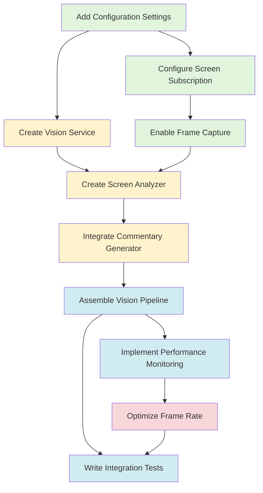

# GOAP Plan: Screen Sharing + AI Vision + Voice Commentary

**Feature**: Real-time screen capture, vision analysis, and spoken AI commentary
**Framework**: Pipecat v0.0.48+ with Daily.co transport
**Project**: /Users/nateaune/Documents/code/ump/voice_referee/
**Created**: 2025-12-14
**Methodology**: Goal-Oriented Action Planning (GOAP)

---

## Executive Summary

This GOAP plan implements AI-powered screen analysis with voice commentary by extending the existing Voice Referee application. The AI agent will see the user's shared screen in real-time, analyze visual content using vision models (GPT-4V, Claude Vision, or Gemini), and provide spoken feedback via TTS.

**Key Metrics:**
- Target latency: 800-1200ms (screen capture → vision analysis → TTS output)
- Vision analysis budget: 200-500ms
- Frame capture rate: 0.5-2 fps (on-demand or periodic)
- Cost per session: ~$0.10-0.30 (vision API calls)

---

## 1. Goal Decomposition

### 1.1 Primary Goal
**Goal State**: `{screen_shared: true, vision_active: true, commentary_enabled: true, latency < 1200ms}`

### 1.2 Sub-Goals

#### SG-1: Screen Capture Capability
- **State**: `{screen_subscription: true, frame_capture: true}`
- **Dependencies**: Daily transport configured, participant present
- **Success Criteria**: UserImageRawFrame objects flowing through pipeline

#### SG-2: Vision Processing Integration
- **State**: `{vision_service: configured, frames_analyzed: true}`
- **Dependencies**: SG-1, vision API key configured
- **Success Criteria**: Vision model returning analysis of screen content

#### SG-3: Commentary Generation
- **State**: `{commentary_contextual: true, voice_output: true}`
- **Dependencies**: SG-2, TTS service active
- **Success Criteria**: Spoken commentary based on visual analysis

#### SG-4: Performance Optimization
- **State**: `{latency < 1200ms, cost_optimized: true}`
- **Dependencies**: SG-1, SG-2, SG-3
- **Success Criteria**: End-to-end latency within budget, minimal API costs

---

## 2. State Space Definition

### 2.1 Current State (Baseline)
```python
{
    # Existing capabilities
    "daily_transport": "configured",
    "audio_pipeline": "working",
    "participant_tracking": "active",
    "deepgram_stt": "configured",
    "claude_llm": "configured",
    "elevenlabs_tts": "configured",
    "pipecat_version": ">=0.0.48",

    # Missing capabilities
    "screen_subscription": false,
    "frame_capture": false,
    "vision_service": false,
    "image_processing": false,
    "visual_commentary": false,
}
```

### 2.2 Target State (Goal)
```python
{
    # Preserved capabilities
    "daily_transport": "configured",
    "audio_pipeline": "working",
    "participant_tracking": "active",
    "deepgram_stt": "configured",
    "claude_llm": "configured",
    "elevenlabs_tts": "configured",
    "pipecat_version": ">=0.0.48",

    # New capabilities
    "screen_subscription": true,
    "frame_capture": true,
    "vision_service": "configured",  # GPT-4V, Claude Vision, or Gemini
    "image_processing": true,
    "visual_commentary": true,
    "latency_measured": true,
    "latency_ms": "< 1200",
}
```

### 2.3 Intermediate States

#### IS-1: Screen Capture Ready
```python
{
    "screen_subscription": true,
    "frame_capture": true,
    "event_handlers": "configured",
    "test_frames_received": true,
}
```

#### IS-2: Vision Analysis Ready
```python
{
    "screen_subscription": true,
    "frame_capture": true,
    "vision_service": "configured",
    "vision_api_key": "validated",
    "frame_processing": true,
}
```

#### IS-3: Commentary Integration Ready
```python
{
    "screen_subscription": true,
    "frame_capture": true,
    "vision_service": "configured",
    "commentary_pipeline": "assembled",
    "test_commentary": true,
}
```

---

## 3. Action Inventory

### 3.1 Actions with Preconditions & Effects

#### A1: Configure Screen Video Subscription
**Type**: Configuration
**Cost**: 1 unit
**Execution**: Code (deterministic)

```python
Preconditions:
  - daily_transport: configured
  - participant_present: true
  - pipecat_version: >=0.0.48

Effects:
  - screen_subscription: true
  - transport_ready_for_capture: true

Implementation:
  @transport.event_handler("on_first_participant_joined")
  async def on_first_participant_joined(transport, participant):
      await transport.update_subscriptions(
          participant_settings={
              participant["id"]: {"media": {"screenVideo": "subscribed"}}
          }
      )
```

#### A2: Enable Frame Capture
**Type**: Configuration
**Cost**: 2 units
**Execution**: Code (deterministic)

```python
Preconditions:
  - screen_subscription: true
  - participant_id: known

Effects:
  - frame_capture: true
  - user_image_frames_flowing: true

Implementation:
  await transport.capture_participant_video(
      participant["id"],
      framerate=0,  # 0 = on-demand, 1 = continuous
      video_source="screenVideo"
  )
```

#### A3: Create Vision Service Processor
**Type**: Implementation
**Cost**: 5 units
**Execution**: Hybrid (code + config)

```python
Preconditions:
  - vision_api_key: configured
  - vision_provider: selected  # "openai" | "anthropic" | "google"

Effects:
  - vision_service: configured
  - frame_processor_ready: true

Implementation:
  # Option 1: OpenAI GPT-4V
  from pipecat.services.openai import OpenAIVisionService
  vision_service = OpenAIVisionService(
      api_key=settings.openai_api_key,
      model="gpt-4-vision-preview"
  )

  # Option 2: Anthropic Claude Vision
  from pipecat.services.anthropic import AnthropicVisionService
  vision_service = AnthropicVisionService(
      api_key=settings.anthropic_api_key,
      model="claude-3-5-sonnet-20241022"
  )

  # Option 3: Google Gemini Vision
  from pipecat.services.google import GoogleVisionService
  vision_service = GoogleVisionService(
      api_key=settings.google_api_key,
      model="gemini-1.5-pro-vision"
  )
```

#### A4: Create Screen Analysis Processor
**Type**: Implementation
**Cost**: 8 units
**Execution**: Hybrid (LLM + code)

```python
Preconditions:
  - vision_service: configured
  - frame_capture: true

Effects:
  - screen_analyzer: configured
  - analysis_pipeline_ready: true

Implementation:
  class ScreenAnalysisProcessor(FrameProcessor):
      """Analyzes screen content and generates commentary triggers."""

      def __init__(self, vision_service, settings):
          self.vision_service = vision_service
          self.analysis_interval = settings.screen_analysis_interval
          self.last_analysis_time = 0

      async def process_frame(self, frame, direction):
          if isinstance(frame, UserImageRawFrame):
              # Check if it's time to analyze
              if self._should_analyze():
                  analysis = await self._analyze_screen(frame)
                  if analysis.requires_commentary:
                      # Queue commentary generation
                      await self.push_frame(
                          CommentaryRequestFrame(
                              analysis=analysis,
                              context=self._get_context()
                          )
                      )

          # Pass through other frames
          await self.push_frame(frame, direction)
```

#### A5: Integrate Commentary Generator
**Type**: Implementation
**Cost**: 6 units
**Execution**: Hybrid (LLM + code)

```python
Preconditions:
  - screen_analyzer: configured
  - llm_service: configured
  - tts_service: configured

Effects:
  - commentary_pipeline: assembled
  - spoken_output: true

Implementation:
  class CommentaryProcessor(FrameProcessor):
      """Generates spoken commentary based on screen analysis."""

      def __init__(self, llm_service, settings):
          self.llm_service = llm_service
          self.commentary_style = settings.commentary_style

      async def process_frame(self, frame, direction):
          if isinstance(frame, CommentaryRequestFrame):
              # Generate commentary prompt
              prompt = self._build_commentary_prompt(
                  frame.analysis,
                  frame.context
              )

              # Queue LLM generation
              await self.push_frame(
                  LLMMessagesFrame([
                      {"role": "system", "content": self.system_prompt},
                      {"role": "user", "content": prompt}
                  ])
              )

          await self.push_frame(frame, direction)
```

#### A6: Assemble Vision Pipeline
**Type**: Integration
**Cost**: 4 units
**Execution**: Code (deterministic)

```python
Preconditions:
  - screen_subscription: true
  - frame_capture: true
  - screen_analyzer: configured
  - commentary_processor: configured

Effects:
  - vision_pipeline: assembled
  - pipeline_ready: true

Implementation:
  pipeline = Pipeline([
      transport.input(),           # Audio + video input
      stt_service,                 # Existing: speech-to-text
      vision_service,              # NEW: Screen frame → vision analysis
      screen_analyzer,             # NEW: Decide when to comment
      referee_monitor,             # Existing: conversation monitoring
      commentary_processor,        # NEW: Generate visual commentary
      llm_service,                 # Existing: text generation
      tts_service,                 # Existing: text-to-speech
      transport.output(),          # Audio output
  ])
```

#### A7: Implement Performance Monitoring
**Type**: Implementation
**Cost**: 3 units
**Execution**: Code (deterministic)

```python
Preconditions:
  - vision_pipeline: assembled

Effects:
  - latency_measured: true
  - metrics_tracked: true

Implementation:
  class PerformanceMonitor:
      def __init__(self):
          self.metrics = {
              "frame_capture_ms": [],
              "vision_analysis_ms": [],
              "commentary_generation_ms": [],
              "tts_synthesis_ms": [],
              "end_to_end_ms": [],
          }

      async def track_vision_latency(self, start, end):
          latency = (end - start) * 1000
          self.metrics["vision_analysis_ms"].append(latency)

      def get_p95_latency(self) -> float:
          """Get 95th percentile latency."""
          return np.percentile(self.metrics["end_to_end_ms"], 95)
```

#### A8: Optimize Frame Capture Rate
**Type**: Optimization
**Cost**: 2 units
**Execution**: Code (deterministic)

```python
Preconditions:
  - vision_pipeline: assembled
  - latency_measured: true

Effects:
  - cost_optimized: true
  - latency_optimized: true

Implementation:
  # Adaptive frame rate based on activity
  class AdaptiveFrameCapture:
      def __init__(self):
          self.base_fps = 0.5  # 1 frame per 2 seconds
          self.active_fps = 2.0  # 2 frames per second

      def adjust_rate(self, activity_level):
          if activity_level == "high":
              return self.active_fps
          elif activity_level == "medium":
              return 1.0
          else:
              return self.base_fps
```

#### A9: Add Configuration Settings
**Type**: Configuration
**Cost**: 2 units
**Execution**: Code (deterministic)

```python
Preconditions:
  - settings_module: exists

Effects:
  - vision_config: available
  - env_vars_documented: true

Implementation:
  class VisionConfig(BaseModel):
      """Configuration for vision-based screen analysis."""

      provider: str = Field(default="anthropic")
      model: str = Field(default="claude-3-5-sonnet-20241022")
      api_key: str = Field(..., description="Vision API key")

      # Analysis settings
      frame_capture_mode: str = Field(default="on_demand")  # "on_demand" | "continuous"
      analysis_interval_seconds: float = Field(default=2.0)
      max_analysis_cost_per_session: float = Field(default=0.30)

      # Commentary settings
      commentary_style: str = Field(default="concise")  # "concise" | "detailed" | "technical"
      commentary_trigger_threshold: float = Field(default=0.6)

      # Performance settings
      max_vision_latency_ms: int = Field(default=500)
      adaptive_frame_rate: bool = Field(default=True)
```

#### A10: Write Integration Tests
**Type**: Testing
**Cost**: 5 units
**Execution**: Code (deterministic)

```python
Preconditions:
  - vision_pipeline: assembled

Effects:
  - tests_written: true
  - coverage_adequate: true

Implementation:
  async def test_screen_capture():
      """Test screen video subscription and frame capture."""
      # Mock participant with screen share
      # Verify UserImageRawFrame received

  async def test_vision_analysis():
      """Test vision service processes frames."""
      # Send test frame
      # Verify analysis returned

  async def test_commentary_generation():
      """Test end-to-end commentary pipeline."""
      # Send test screen frame
      # Verify spoken commentary produced

  async def test_latency_performance():
      """Test latency meets requirements."""
      # Measure end-to-end latency
      # Assert < 1200ms
```

---

## 4. Dependency Graph



**Legend:**
- Green: Configuration actions (low risk)
- Yellow: Implementation actions (medium risk)
- Blue: Integration actions (medium risk)
- Red: Optimization actions (high risk if done prematurely)

---

## 5. Optimal Action Sequence (A* Path)

Using A* search with cost minimization and dependency satisfaction:

### Phase 1: Foundation (Days 1-2)
**Milestone**: M1 - Screen capture working
**Total Cost**: 5 units

| Step | Action | Cost | Cumulative | Dependencies | Validation |
|------|--------|------|------------|--------------|------------|
| 1 | A9: Add Configuration Settings | 2 | 2 | None | Config module updated |
| 2 | A1: Configure Screen Subscription | 1 | 3 | A9 | Event handler registered |
| 3 | A2: Enable Frame Capture | 2 | 5 | A1, A9 | UserImageRawFrame logged |

**Success Criteria:**
- Screen sharing triggers subscription
- Frames captured and logged
- No errors in transport layer

---

### Phase 2: Vision Integration (Days 3-5)
**Milestone**: M2 - Vision analysis working
**Total Cost**: 13 units (18 cumulative)

| Step | Action | Cost | Cumulative | Dependencies | Validation |
|------|--------|------|------------|--------------|------------|
| 4 | A3: Create Vision Service Processor | 5 | 10 | A9 | API connection verified |
| 5 | A4: Create Screen Analysis Processor | 8 | 18 | A2, A3 | Analysis results logged |

**Success Criteria:**
- Vision API successfully called
- Screen content analyzed
- Analysis data structure validated

---

### Phase 3: Commentary Pipeline (Days 6-8)
**Milestone**: M3 - End-to-end commentary working
**Total Cost**: 10 units (28 cumulative)

| Step | Action | Cost | Cumulative | Dependencies | Validation |
|------|--------|------|------------|--------------|------------|
| 6 | A5: Integrate Commentary Generator | 6 | 24 | A4 | Commentary text generated |
| 7 | A6: Assemble Vision Pipeline | 4 | 28 | A2, A4, A5 | TTS output heard |

**Success Criteria:**
- Commentary contextually relevant
- Spoken output audible
- No pipeline errors

---

### Phase 4: Performance & Testing (Days 9-12)
**Milestone**: M4 - Production-ready
**Total Cost**: 10 units (38 cumulative)

| Step | Action | Cost | Cumulative | Dependencies | Validation |
|------|--------|------|------------|--------------|------------|
| 8 | A7: Implement Performance Monitoring | 3 | 31 | A6 | Metrics dashboard |
| 9 | A8: Optimize Frame Capture Rate | 2 | 33 | A7 | Latency < 1200ms |
| 10 | A10: Write Integration Tests | 5 | 38 | A6, A8 | >80% coverage |

**Success Criteria:**
- P95 latency < 1200ms
- Cost per session < $0.30
- All tests passing

---

## 6. Risk Assessment

### 6.1 Technical Risks

#### R1: Vision API Latency
**Probability**: Medium (40%)
**Impact**: High
**Mitigation**:
- Use faster models (Claude Haiku, GPT-4V-turbo)
- Implement aggressive caching
- Pre-process frames (resize, compress)
- Fallback to simpler analysis on timeout

#### R2: Frame Capture Reliability
**Probability**: Medium (30%)
**Impact**: High
**Mitigation**:
- Robust error handling for missing frames
- Retry logic for failed captures
- Monitor participant screen-share status
- Graceful degradation to audio-only

#### R3: Cost Overruns
**Probability**: Low (20%)
**Impact**: Medium
**Mitigation**:
- Implement per-session cost tracking
- Use adaptive frame rate (fewer frames when static)
- Set hard limits in configuration
- Choose cost-effective models (Claude Haiku: $0.25/1M tokens)

#### R4: Commentary Quality
**Probability**: Medium (35%)
**Impact**: Medium
**Mitigation**:
- Detailed system prompts for commentary style
- Context-aware triggers (only comment on changes)
- User feedback mechanism
- A/B test different prompt strategies

#### R5: Pipeline Complexity
**Probability**: Low (25%)
**Impact**: Medium
**Mitigation**:
- Incremental integration
- Comprehensive unit tests at each stage
- Feature flag for vision pipeline
- Rollback plan to audio-only mode

---

### 6.2 Dependency Risks

#### DR1: Pipecat API Changes
**Probability**: Low (15%)
**Impact**: High
**Mitigation**:
- Pin pipecat version in requirements.txt
- Monitor Pipecat GitHub releases
- Maintain compatibility layer
- Regression test suite

#### DR2: Daily.co Screen Share Support
**Probability**: Low (10%)
**Impact**: High
**Mitigation**:
- Verify Daily.co API documentation
- Test with multiple browsers/platforms
- Fallback to uploaded images if live capture fails

#### DR3: Vision Provider Availability
**Probability**: Low (15%)
**Impact**: Medium
**Mitigation**:
- Support multiple vision providers (OpenAI, Anthropic, Google)
- Automatic failover between providers
- Graceful degradation message to user

---

## 7. Implementation Timeline

### Overview
**Total Duration**: 12 days
**Total Cost**: 38 action units
**Phases**: 4
**Milestones**: 4

---

### Phase 1: Foundation (Days 1-2)
**Focus**: Screen capture infrastructure

**Days 1:**
- Morning: A9 - Add configuration settings (VisionConfig, env vars)
- Afternoon: A1 - Configure screen subscription in transport events

**Day 2:**
- Morning: A2 - Enable frame capture with logging
- Afternoon: Test screen share → frame flow, validate UserImageRawFrame

**Deliverables:**
- `src/config/vision_config.py` - Vision configuration module
- Updated `src/services/daily_transport.py` - Screen subscription handlers
- Test script demonstrating frame capture

**Validation Gate:**
- [ ] Screen share detected
- [ ] Frames logged with correct format
- [ ] No transport errors

---

### Phase 2: Vision Integration (Days 3-5)
**Focus**: Vision API integration and analysis

**Day 3:**
- Morning: A3 - Create vision service wrapper (select provider)
- Afternoon: Configure API keys, test basic vision API call

**Day 4-5:**
- A4 - Implement ScreenAnalysisProcessor
- Design analysis triggers (when to analyze vs skip)
- Implement commentary decision logic

**Deliverables:**
- `src/services/vision_service.py` - Vision API wrapper
- `src/processors/screen_analyzer.py` - Screen analysis processor
- `src/frames/vision_frames.py` - Custom frame types

**Validation Gate:**
- [ ] Vision API returning analysis
- [ ] Analysis quality acceptable
- [ ] Analysis latency < 500ms

---

### Phase 3: Commentary Pipeline (Days 6-8)
**Focus**: End-to-end pipeline integration

**Day 6-7:**
- A5 - Implement CommentaryProcessor
- Design commentary prompts
- Integrate with existing LLM service

**Day 8:**
- A6 - Assemble complete vision pipeline
- Wire all components together
- End-to-end testing

**Deliverables:**
- `src/processors/commentary_processor.py` - Commentary generator
- Updated `src/pipeline/main.py` - Vision pipeline assembly
- `prompts/screen_commentary.txt` - Commentary system prompt

**Validation Gate:**
- [ ] Commentary generated from screen content
- [ ] TTS output matches visual context
- [ ] No pipeline crashes

---

### Phase 4: Performance & Testing (Days 9-12)
**Focus**: Optimization and production readiness

**Day 9:**
- A7 - Implement performance monitoring
- Add metrics dashboard/logging

**Day 10:**
- A8 - Optimize frame capture rate
- Implement adaptive frame rate
- Cost optimization

**Day 11-12:**
- A10 - Write comprehensive tests
- Integration testing
- Performance validation
- Documentation

**Deliverables:**
- `src/monitoring/performance.py` - Performance monitoring
- `tests/integration/test_vision_pipeline.py` - Integration tests
- `docs/vision-feature.md` - Feature documentation
- Performance report with latency metrics

**Validation Gate:**
- [ ] P95 latency < 1200ms
- [ ] Cost per session < $0.30
- [ ] Test coverage > 80%
- [ ] Documentation complete

---

## 8. Success Criteria

### 8.1 Functional Requirements
- [ ] **FR-1**: System detects when participant starts screen sharing
- [ ] **FR-2**: Screen frames captured at configurable rate (0.5-2 fps)
- [ ] **FR-3**: Vision model analyzes screen content with >80% relevance
- [ ] **FR-4**: Commentary generated contextually based on visual analysis
- [ ] **FR-5**: Spoken commentary delivered via existing TTS pipeline
- [ ] **FR-6**: Graceful fallback to audio-only if screen share unavailable

### 8.2 Performance Requirements
- [ ] **PR-1**: End-to-end latency (screen → commentary) < 1200ms (P95)
- [ ] **PR-2**: Vision analysis latency < 500ms (P95)
- [ ] **PR-3**: Frame capture overhead < 50ms
- [ ] **PR-4**: Cost per 30-minute session < $0.30
- [ ] **PR-5**: System handles 1-2 concurrent screen sharers

### 8.3 Quality Requirements
- [ ] **QR-1**: Unit test coverage > 80% for new components
- [ ] **QR-2**: Integration tests validate full vision pipeline
- [ ] **QR-3**: Error handling for API failures, network issues
- [ ] **QR-4**: Logging sufficient for debugging production issues
- [ ] **QR-5**: Configuration externalized (no hardcoded keys/settings)

### 8.4 Usability Requirements
- [ ] **UR-1**: Commentary style configurable (concise/detailed/technical)
- [ ] **UR-2**: Feature can be enabled/disabled via config flag
- [ ] **UR-3**: Clear error messages when vision unavailable
- [ ] **UR-4**: Documentation for setup and configuration

---

## 9. Rollback & Contingency Plans

### 9.1 Feature Flag Strategy
```python
class VisionConfig(BaseModel):
    enabled: bool = Field(default=False)  # Off by default

    # In pipeline assembly:
    if settings.vision.enabled:
        pipeline.add_processor(vision_service)
        pipeline.add_processor(screen_analyzer)
        pipeline.add_processor(commentary_processor)
```

### 9.2 Graceful Degradation
```python
class ScreenAnalysisProcessor(FrameProcessor):
    async def process_frame(self, frame, direction):
        try:
            if isinstance(frame, UserImageRawFrame):
                analysis = await self._analyze_screen(frame)
                # Process analysis...
        except VisionAPIError as e:
            logger.warning(f"Vision API unavailable: {e}")
            # Continue with audio-only mode
        except Exception as e:
            logger.error(f"Screen analysis failed: {e}")
            # Don't crash pipeline, just skip this frame

        await self.push_frame(frame, direction)
```

### 9.3 Rollback Triggers
1. **Latency exceeds 2000ms** - Disable vision, revert to audio-only
2. **Cost exceeds $0.50/session** - Reduce frame rate or disable
3. **Error rate > 10%** - Disable vision feature
4. **User complaints > 3** - Review and iterate

---

## 10. Cost-Benefit Analysis

### 10.1 Development Costs
- Engineer time: 12 days × 8 hours = 96 hours
- API testing credits: ~$50
- **Total**: ~$50 + development time

### 10.2 Operational Costs (per session, 30 min)
**Baseline (audio-only):**
- STT (Deepgram): ~$0.006 (0.5hr @ $0.0125/min)
- LLM (Claude): ~$0.015 (10k tokens @ $3/1M)
- TTS (ElevenLabs): ~$0.072 (600 chars/min @ $0.24/1k chars)
- **Total**: ~$0.09/session

**With Vision:**
- STT (Deepgram): ~$0.006
- LLM (Claude): ~$0.020 (more context)
- TTS (ElevenLabs): ~$0.084 (more commentary)
- **Vision (Claude Haiku)**: ~$0.15 (60 frames @ $0.25/1M tokens)
- **Total**: ~$0.26/session

**Incremental cost**: +$0.17/session (+189%)

### 10.3 Pricing Impact
If charging $5/session:
- Baseline margin: $4.91 (98.2%)
- With vision margin: $4.74 (94.8%)
- **Margin reduction**: 3.4 percentage points

**Recommendation**: Acceptable for premium feature

---

## 11. Monitoring & Observability

### 11.1 Key Metrics to Track

**Latency Metrics:**
```python
metrics = {
    "screen_capture_latency_ms": Histogram(),
    "vision_api_latency_ms": Histogram(),
    "commentary_generation_ms": Histogram(),
    "end_to_end_vision_latency_ms": Histogram(),
}
```

**Business Metrics:**
```python
metrics = {
    "vision_sessions_started": Counter(),
    "vision_frames_analyzed": Counter(),
    "vision_api_calls": Counter(),
    "vision_api_errors": Counter(),
    "vision_cost_usd": Gauge(),
}
```

**Quality Metrics:**
```python
metrics = {
    "commentary_generated": Counter(),
    "commentary_relevant": Gauge(),  # User feedback
    "frames_skipped": Counter(),
    "vision_errors_rate": Gauge(),
}
```

### 11.2 Alerts
- **Alert**: P95 latency > 1500ms → Investigate performance
- **Alert**: Error rate > 5% → Check API availability
- **Alert**: Cost > $0.40/session → Review frame rate
- **Alert**: No frames captured for 60s → Check screen share

---

## 12. Future Enhancements

### 12.1 Short-term (Next 3 months)
- **Multi-model support**: Fallback between OpenAI/Anthropic/Google
- **Smart frame selection**: Only analyze when screen changes significantly
- **Commentary caching**: Avoid re-analyzing similar screens
- **User controls**: Allow user to trigger analysis on-demand

### 12.2 Medium-term (3-6 months)
- **OCR integration**: Extract text from screen for better analysis
- **Object detection**: Identify specific UI elements, charts, code
- **Screen recording**: Save analyzed frames for session replay
- **Real-time annotations**: Overlay AI insights on screen

### 12.3 Long-term (6-12 months)
- **Collaborative analysis**: Multi-participant screen analysis
- **AI screenshare presentation**: AI presents slides with commentary
- **Vision-based Q&A**: Answer questions about visual content
- **Automated summaries**: Generate visual session summaries

---

## 13. References & Resources

### 13.1 Pipecat Documentation
- **Screen sharing feature**: GitHub Issue #544, PR #726
- **Vision services**: `/examples/vision/`
- **Frame processors**: `/docs/processors.md`
- **Daily transport**: `/docs/transports/daily.md`

### 13.2 Vision Provider APIs
- **OpenAI GPT-4V**: https://platform.openai.com/docs/guides/vision
- **Anthropic Claude Vision**: https://docs.anthropic.com/claude/docs/vision
- **Google Gemini Vision**: https://ai.google.dev/docs/vision

### 13.3 Example Implementations
- Pipecat foundational example 43a: HeyGen video service
- Pipecat foundational example 07: Interruptible responses
- Daily.co screen share docs: https://docs.daily.co/reference/daily-js/events/participant-updated

### 13.4 Project Files
- `/Users/nateaune/Documents/code/ump/voice_referee/src/pipeline/main.py`
- `/Users/nateaune/Documents/code/ump/voice_referee/src/services/daily_transport.py`
- `/Users/nateaune/Documents/code/ump/voice_referee/src/config/settings.py`
- `/Users/nateaune/Documents/code/ump/docs/tasks.md`

---

## 14. Execution Checklist

### Pre-Implementation
- [ ] Review plan with stakeholders
- [ ] Confirm vision provider selection (recommend: Anthropic Claude)
- [ ] Obtain API keys for vision service
- [ ] Update Pipecat to v0.0.48+
- [ ] Create feature branch: `feature/screen-vision-commentary`

### Phase 1 Checklist
- [ ] Create `VisionConfig` in settings
- [ ] Add environment variables to `.env.example`
- [ ] Implement screen subscription in transport
- [ ] Test frame capture with logging
- [ ] Validate UserImageRawFrame format

### Phase 2 Checklist
- [ ] Create `VisionService` wrapper
- [ ] Implement `ScreenAnalysisProcessor`
- [ ] Define custom frame types
- [ ] Test vision API integration
- [ ] Measure analysis latency

### Phase 3 Checklist
- [ ] Implement `CommentaryProcessor`
- [ ] Design commentary system prompt
- [ ] Assemble vision pipeline
- [ ] End-to-end integration test
- [ ] Test with real screen sharing

### Phase 4 Checklist
- [ ] Add performance monitoring
- [ ] Implement adaptive frame rate
- [ ] Write unit tests (>80% coverage)
- [ ] Write integration tests
- [ ] Performance validation
- [ ] Update documentation
- [ ] Create feature flag
- [ ] Production deployment plan

---

## Appendix A: Code Templates

### A.1 Transport Event Handler
```python
# In src/services/daily_transport.py

@transport.event_handler("on_first_participant_joined")
async def on_first_participant_joined(transport, participant):
    """Enable screen video subscription for participant."""
    participant_id = participant["id"]

    logger.info(f"Subscribing to screen video for {participant_id}")

    # Subscribe to screen video
    await transport.update_subscriptions(
        participant_settings={
            participant_id: {
                "media": {
                    "screenVideo": "subscribed"
                }
            }
        }
    )

    # Enable frame capture (on-demand mode)
    await transport.capture_participant_video(
        participant_id,
        framerate=0,  # 0 = on-demand
        video_source="screenVideo"
    )

    logger.info(f"Screen capture enabled for {participant_id}")
```

### A.2 Vision Service Wrapper
```python
# src/services/vision_service.py

from pipecat.services.anthropic import AnthropicVisionService
from src.config.settings import VisionConfig

async def create_vision_service(config: VisionConfig):
    """Create vision service based on configuration.

    Args:
        config: Vision configuration

    Returns:
        Configured vision service
    """
    if config.provider == "anthropic":
        service = AnthropicVisionService(
            api_key=config.api_key,
            model=config.model,
        )
    elif config.provider == "openai":
        from pipecat.services.openai import OpenAIVisionService
        service = OpenAIVisionService(
            api_key=config.api_key,
            model=config.model,
        )
    elif config.provider == "google":
        from pipecat.services.google import GoogleVisionService
        service = GoogleVisionService(
            api_key=config.api_key,
            model=config.model,
        )
    else:
        raise ValueError(f"Unsupported vision provider: {config.provider}")

    return service
```

### A.3 Screen Analysis Processor
```python
# src/processors/screen_analyzer.py

from pipecat.frames.frames import Frame, UserImageRawFrame
from pipecat.processors.frame_processor import FrameProcessor
from dataclasses import dataclass
import time
import logging

logger = logging.getLogger(__name__)

@dataclass
class ScreenAnalysisFrame(Frame):
    """Frame containing screen analysis results."""
    analysis: dict
    timestamp: float
    requires_commentary: bool

class ScreenAnalysisProcessor(FrameProcessor):
    """Analyzes screen content and triggers commentary."""

    def __init__(self, vision_service, settings):
        super().__init__()
        self.vision_service = vision_service
        self.analysis_interval = settings.vision.analysis_interval_seconds
        self.last_analysis_time = 0
        self.frame_count = 0

    async def process_frame(self, frame: Frame, direction):
        """Process frames, analyzing screen content periodically."""

        if isinstance(frame, UserImageRawFrame):
            self.frame_count += 1
            current_time = time.time()

            # Check if it's time to analyze
            if self._should_analyze(current_time):
                logger.info(f"Analyzing screen frame {self.frame_count}")

                try:
                    # Perform vision analysis
                    analysis = await self._analyze_screen(frame)

                    # Create analysis frame
                    analysis_frame = ScreenAnalysisFrame(
                        analysis=analysis,
                        timestamp=current_time,
                        requires_commentary=self._should_comment(analysis)
                    )

                    # Push analysis frame
                    await self.push_frame(analysis_frame, direction)

                    # Update last analysis time
                    self.last_analysis_time = current_time

                except Exception as e:
                    logger.error(f"Screen analysis failed: {e}", exc_info=True)

        # Pass through all frames
        await self.push_frame(frame, direction)

    def _should_analyze(self, current_time: float) -> bool:
        """Determine if current frame should be analyzed."""
        return (current_time - self.last_analysis_time) >= self.analysis_interval

    async def _analyze_screen(self, frame: UserImageRawFrame) -> dict:
        """Analyze screen content using vision service."""
        # Implementation depends on vision service API
        # This is a placeholder
        analysis = await self.vision_service.analyze(
            frame.image,
            prompt="Describe what you see on this screen. Focus on key elements, changes, or notable content."
        )
        return analysis

    def _should_comment(self, analysis: dict) -> bool:
        """Determine if analysis warrants commentary."""
        # Example logic - customize based on needs
        if "error" in analysis.get("description", "").lower():
            return True
        if analysis.get("confidence", 0) > 0.8:
            return True
        return False
```

### A.4 Commentary Processor
```python
# src/processors/commentary_processor.py

from pipecat.frames.frames import Frame, LLMMessagesFrame
from pipecat.processors.frame_processor import FrameProcessor
from .screen_analyzer import ScreenAnalysisFrame
import logging

logger = logging.getLogger(__name__)

COMMENTARY_SYSTEM_PROMPT = """You are an AI assistant providing concise spoken commentary about screen content.

Guidelines:
- Keep responses SHORT (1-2 sentences max)
- Focus on what's NOTABLE or CHANGED
- Use conversational, natural language
- Avoid technical jargon unless relevant
- Don't describe everything - only highlights

Examples:
- "I notice you're looking at a data dashboard with increasing trends."
- "There's an error message on the screen - looks like a connection issue."
- "You've switched to a code editor. The file appears to be a Python script."
"""

class CommentaryProcessor(FrameProcessor):
    """Generates spoken commentary based on screen analysis."""

    def __init__(self, settings):
        super().__init__()
        self.commentary_style = settings.vision.commentary_style
        self.system_prompt = self._build_system_prompt()

    async def process_frame(self, frame: Frame, direction):
        """Process frames, generating commentary for screen analysis."""

        if isinstance(frame, ScreenAnalysisFrame):
            if frame.requires_commentary:
                logger.info("Generating commentary for screen analysis")

                # Build prompt from analysis
                user_prompt = self._build_user_prompt(frame.analysis)

                # Create LLM messages frame
                llm_frame = LLMMessagesFrame([
                    {"role": "system", "content": self.system_prompt},
                    {"role": "user", "content": user_prompt}
                ])

                # Push to LLM service
                await self.push_frame(llm_frame, direction)

        # Pass through all frames
        await self.push_frame(frame, direction)

    def _build_system_prompt(self) -> str:
        """Build system prompt based on commentary style."""
        base_prompt = COMMENTARY_SYSTEM_PROMPT

        if self.commentary_style == "detailed":
            base_prompt += "\n\nProvide more detailed observations (2-3 sentences)."
        elif self.commentary_style == "technical":
            base_prompt += "\n\nFocus on technical details and use domain-specific terminology."

        return base_prompt

    def _build_user_prompt(self, analysis: dict) -> str:
        """Build user prompt from analysis results."""
        description = analysis.get("description", "Unknown content")
        confidence = analysis.get("confidence", 0)

        prompt = f"Screen content: {description}\n\n"
        prompt += "Provide brief spoken commentary about what you observe."

        return prompt
```

---

## Appendix B: Testing Strategy

### B.1 Unit Tests
```python
# tests/unit/test_screen_analyzer.py

import pytest
from src.processors.screen_analyzer import ScreenAnalysisProcessor
from pipecat.frames.frames import UserImageRawFrame
from unittest.mock import Mock, AsyncMock

@pytest.mark.asyncio
async def test_screen_analyzer_processes_frames():
    """Test screen analyzer processes UserImageRawFrame."""
    mock_vision_service = Mock()
    mock_vision_service.analyze = AsyncMock(return_value={
        "description": "A data dashboard",
        "confidence": 0.9
    })

    settings = Mock()
    settings.vision.analysis_interval_seconds = 1.0

    analyzer = ScreenAnalysisProcessor(mock_vision_service, settings)

    # Create test frame
    frame = UserImageRawFrame(
        image=b"fake_image_data",
        size=(1920, 1080),
        format="RGB"
    )

    # Process frame
    await analyzer.process_frame(frame, "forward")

    # Verify analysis called
    assert mock_vision_service.analyze.called

@pytest.mark.asyncio
async def test_screen_analyzer_respects_interval():
    """Test analyzer respects analysis interval."""
    # Implementation here
    pass
```

### B.2 Integration Tests
```python
# tests/integration/test_vision_pipeline.py

import pytest
import asyncio
from src.pipeline.main import create_pipeline
from src.config.settings import get_settings

@pytest.mark.asyncio
async def test_vision_pipeline_end_to_end(mock_daily_transport, mock_vision_api):
    """Test complete vision pipeline from screen capture to commentary."""
    settings = get_settings()
    settings.vision.enabled = True

    pipeline, task = create_pipeline(settings)

    # Simulate screen share start
    await mock_daily_transport.simulate_participant_joined(screen_share=True)

    # Wait for frame capture
    await asyncio.sleep(0.5)

    # Verify vision API called
    assert mock_vision_api.call_count > 0

    # Verify commentary generated
    # Check TTS output queue

    # Measure latency
    # Assert latency < 1200ms
```

---

**End of GOAP Plan**

---

**Next Steps:**
1. Review this plan with stakeholders
2. Confirm vision provider selection (recommend: Anthropic Claude Vision)
3. Obtain API keys
4. Create feature branch and begin Phase 1
5. Track progress in `/Users/nateaune/Documents/code/ump/docs/tasks.md`
